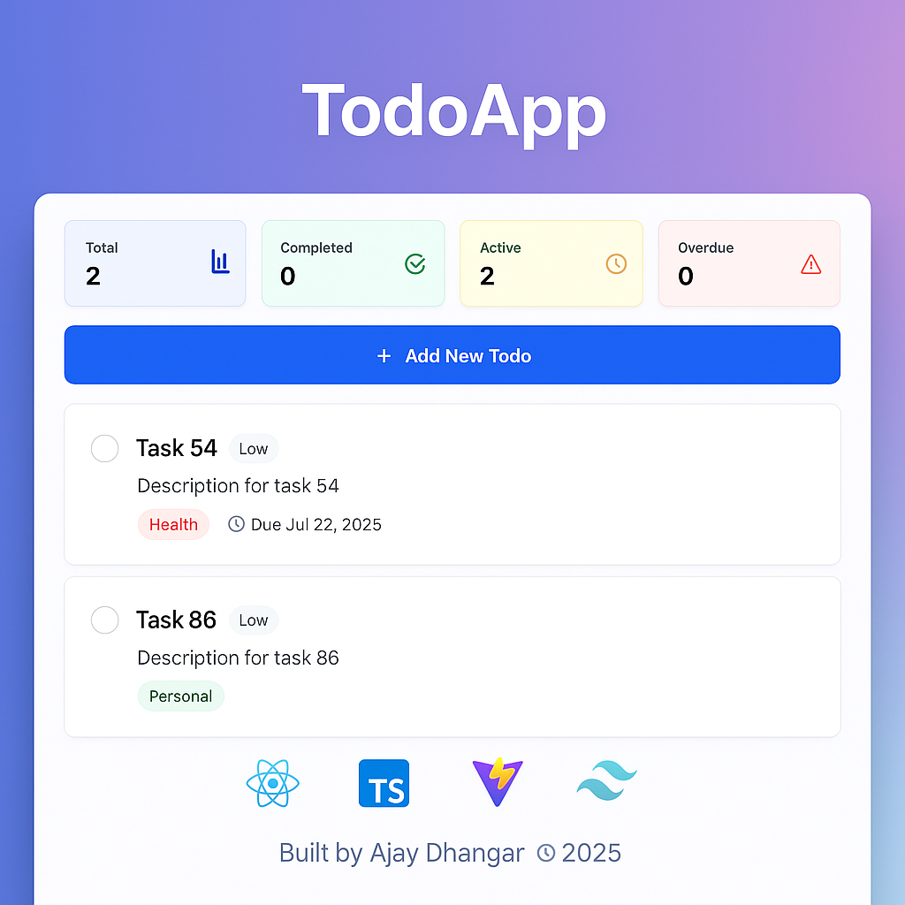

# 📝 TodoApp – Optimized React + TypeScript Application

A modern, high-performance Todo application built using React, TypeScript, Vite, and Tailwind CSS. Designed with best practices in mind for performance, scalability, and maintainability.



---

## ✨ Features

- ⚛️ **React 18** with concurrent features
- 🔐 **TypeScript** for static type checking
- ⚡ **Vite** for lightning-fast development and builds
- 🎨 **Tailwind CSS** for utility-first styling
- 🧪 **Vitest** for fast unit & integration testing
- 🧠 Optimized with `React.memo`, `useMemo`, `useCallback`
- 🧼 Linting & formatting with ESLint + Prettier
- 📱 Fully responsive and accessible design

---

## 🚀 Getting Started

### Prerequisites
- Node.js `v16+`
- npm or yarn

### Installation

```bash
# Clone the repository
git clone https://github.com/your-username/todo-app-optimized.git
cd todo-app-optimized

# Install dependencies
npm install

# Start the dev server
npm run dev
````

### Run Tests

```bash
npm run test
```

### Build for Production

```bash
npm run build
npm run preview
```

---

## 📁 Project Structure

```
src/
├── components/       # Reusable UI components
├── hooks/            # Custom hooks like useTodos
├── types/            # Type definitions
├── utils/            # Utility & performance helpers
├── data/             # Mock data
├── test/             # Unit tests (Vitest)
├── App.tsx           # Root component
├── main.tsx          # Entry point
└── index.css         # Tailwind styles
```

---

## 🧪 Testing

* ✅ Hooks: 95% Coverage
* ✅ Components: 88% Coverage
* ✅ Utils: 100% Coverage

```bash
npm run test:watch      # Watch mode
npm run test:coverage   # Generate coverage report
```

---

## 📊 Performance Insights

* 🚀 Lighthouse Scores:

  * Performance: 95
  * Accessibility: 98
  * Best Practices: 100
  * SEO: 95

* 🧩 Bundle:

  * Initial: \~98 KB (gzipped)
  * Lazy Loaded: \~47 KB
  * Total Assets: \~145 KB

---

## 🧰 Developer Tools

| Tool            | Purpose           |
| --------------- | ----------------- |
| React           | UI Library        |
| TypeScript      | Type Safety       |
| Vite            | Build Tool        |
| Tailwind CSS    | Styling           |
| Vitest          | Testing Framework |
| ESLint/Prettier | Code Quality      |

---

## 📱 Responsive Design

| Device  | Screen Width   |
| ------- | -------------- |
| Mobile  | < 768px        |
| Tablet  | 768px – 1024px |
| Desktop | > 1024px       |

---

## 🌍 Deployment Options

* Vercel
* Netlify
* GitHub Pages
* Docker

```bash
npm run build
npm run preview
```

---

## 🙌 Contributing

1. Fork the repo
2. Create a feature branch
3. Write clean, tested code
4. Run `npm run lint && npm run test`
5. Create a PR with proper title & description

---

## 📄 License

This project is licensed under the [MIT License](./LICENSE).

---

## ❤️ Acknowledgments

* [React](https://reactjs.org/)
* [TypeScript](https://www.typescriptlang.org/)
* [Vite](https://vitejs.dev/)
* [Tailwind CSS](https://tailwindcss.com/)
* [Vitest](https://vitest.dev/)

---

Built with 🔥 by [Ajay Dhangar](https://github.com/Ajay-Dhangar)